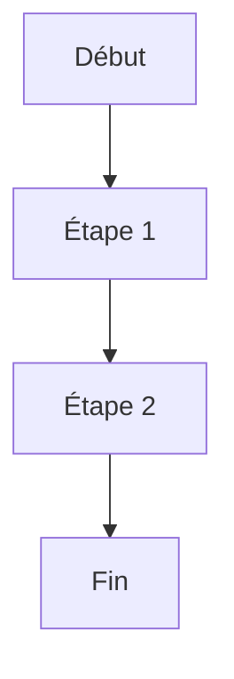

# ☁️ Persistance cloud et Backend-as-a-Service (BaaS)

## 🎯 Objectif d'apprentissage
À la fin de ce chapitre, vous serez capable de :
- Expliquer ce qu'est un **Backend-as-a-Service (BaaS)** et pourquoi il facilite le développement mobile.
- Comprendre l'intérêt du **cloud** dans une application moderne.
- Faire la différence entre **Supabase**, **Firebase**, **Appwrite**, **AWS Amplify**, etc.
- Gérer des données distances (CRUD), la synchro cloud &harr; local, et la gestion des permissions.
- Intégrer dans une app mobile :
  - une **base de données distante**,
  - du **stockage de fichiers**,
  - des **fonctions serverless**,
  - des **notifications push**,
  - une **authentification utilisateur**.

::: danger
chapitre authentification utilisateur supabase auth rappel etc.
:::

## 🤔 2.6.1 Introduction : pourquoi un backend cloud ?
Les applications mobiles modernes ne se contentent plus de fonctionner localement : elles doivent **synchroniser les données**, **gérer des profils utilisateurs**, et permettre un usage fluide **sur plusieurs appareils**.

Cela implique généralement :
- une **base de données distante**,
- une **API** pour gérer les lectures/écritures,
- une **authentification**,
- un **stockage de fichiers** (images, PDF, etc.),
- des **fonctions serveur**,
- une **gestion des permissions**.

Créer tout cela manuellement est long, coûteux, et n écessite de gérer un serveur, sa sécurité, sa scalabilité et sa maintenance.

C'est là que les **Backend-as-a-Service (BaaS)** deviennent extrêmement attractifs.

### 🤷 Qu'est-ce qu'un backend cloud apporte réellement ?
- Vos données sont **stockées et sauvegardées** automatiquement.
- Les utilisateurs peuvent retrouver leurs informations depuis **n'importe quel appareil**.
- Les mises à jour sont instantanées grâce aux APIs.
- La majorité du "travail serveur" est automatisée : authentification, règles de sécurité, fichiers, etc.
- Vous ne gérez **ni serveurs**, **ni maintenance**, **ni mise à l'échelle**.

::: details **💡 Exemple concret :** {open}
Une app mobile où les élèves stockent leurs notes et photos de projet :
&rarr; en changeant de téléphone, tout est déjà en ligne : rien ne se perd !
:::

## 🏭 2.6.2 Qu'est-ce qu'un Backend-as-a-Service (BaaS) ?
Un **BaaS** est un service cloud prêt à l'emploi, qui fournit toutes les briques indispensables d'un backend moderne, sans devoir coder une API ou installer un serveur.

### Un BaaS fournit généralement :
- **🔏 Authentification** (email, OAuth, etc.)
- **🗄️ Base de données distante** (SQL ou NoSQL)
- **🖼️ Stockage de fichiers** (images, vidéos, etc.)
- **🌐 API automatiquement générée**
- **⚙️ Fonctions serverless** (exécuter du code côté serveur)
- **🔔 Notifications push**
- **🛡️ Gestion des rôles et permissions**
- **📊 Logs & Analytics**

### ➕️ Avantages principaux
- **Aucune infrastructure à gére** (backup, sécurité, mises à jour).
- **Développement rapide** grâce à des API prêtes à l'emploi.
- **Sécurité intégrée** (permission, règles d'accès, tokens JWT).
- **Scalabilité automatique** : le service s'adapte à la charge.
- **Parfait pour les projets mobiles**, qui ont besoins de synchro et d'auth.
- **Coût maîtrisé** : payez selon l'usage (nombre d'utilisateurs, stockage, etc.).

### ⚠️ Limites
- Dépendance au fournisseur.
- Des coûts qui augmentent si l'app grandit fortement.
- Moins flexible qu'un backend développé entièrement sur mesure.
> 💬 Pour un module pédagogique ou une application interne, un BaaS est souvent le meilleur choix.

## 🧱 2.6.3 Comment fonctionne une base cloud ?
Voici le cycle classique d'un échange entre une app mobile et un backend cloud :

::: danger
schématiser ça avec accordion ?
:::

